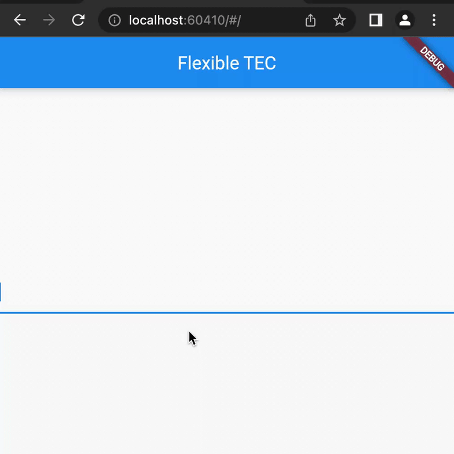

# flexible_text_editing_controller_flutter
An extended text editing controller that supports different inline styles for custom regex.
###### a text editing controller that can display suggestion text after input, and style input and suggestion ( can be configured to highlight syntax)

demo: https://github.com/monki1/flutter_flexible_text_editing_controller_demo

## Getting Started


### 1.Depend on it
#### command line

```
$ flutter pub add flexible_text_editing_controller

```
#### or add to yaml
###### from git
```yaml
  flexible_text_editing_controller:
    git:
      url: https://github.com/monki1/flexible_text_editing_controller_flutter
      ref: 098ad30
```
###### from pub.dev
```yaml
  flexible_text_editing_controller: ^1.0.0+2
 ```
  
### 2. Install it
```commandline
flutter pub get
```

### 3. Import it

```dart
import'flexible_text_editing_controller/flexible_text_editing_controller.dart';
```

## Usage
```dart
TextSpan styler(String text, TextStyle? defaultStyle) {
  List<TextSpan> children = [];
  for (int i = 0; i < text.length; i++) {
    i % 2 == 0
        ? children.add(TextSpan(
        text: text.substring(i, i + 1),
        ///red for even, 
        style: TextStyle(color: Colors.red)))
        : children.add(TextSpan(
        text: text.substring(i, i + 1),
        ///blue for odd
        style: TextStyle(color: Colors.blue)));
  }
  return TextSpan(style: defaultStyle, children: children);
}
///see demo for functional example
```

## Versioning

- **V1.0.0+2** - added demo.

## Authors

**monki1** - [Github](https://github.com/monki1)

## License

This project is licensed under the MIT License - see the [LICENSE](LICENSE) file for details
# flexible_text_editing_controller_flutter
